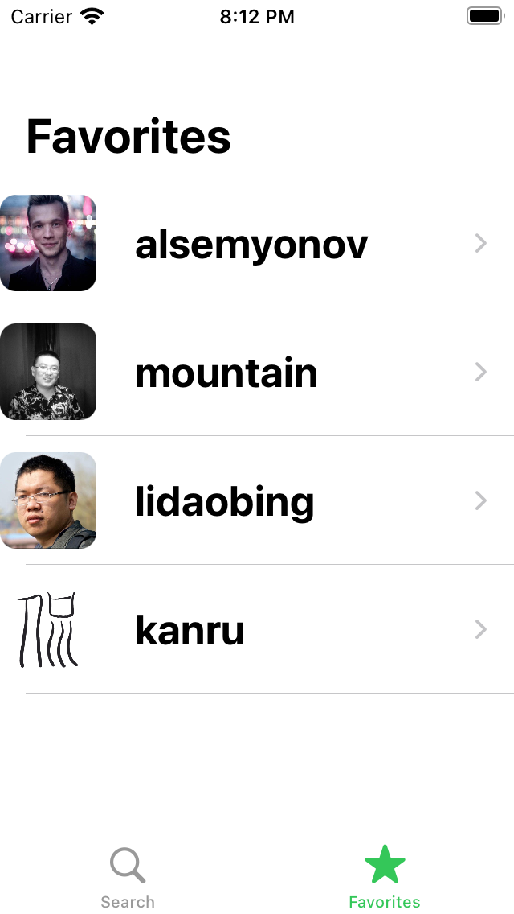

# GHFollowers
An application which displays the followers that a Github user has. 

## Description
The application uses the [GitHub's Users API](https://docs.github.com/en/rest/reference/users) to show information about a user.
[Users API]
**Main concepts learned**:
 - Programmatic UI
 - Modern concurrency
 - Dynamic Type
 - Refactoring
## Screens
The following is a description of the main screens of the application:
### SearchVC
The user uses this screen to search for a GitHub account by entering the username in a textfield. Once the "Get Followers" button is pressed, the FollowerListVC gets presented on the screen.


### FollowerListVC
It displays a collection view containing all the followers that a user might have. The user can filter the results on the screen using a search bar. As the user scrolls down and reaches the end of the list, the next hundred of followers gets loaded. Once the user taps on a follower the app presents the UserInfoVC modally.


### FavoriteListVC
It displays a table view with all the user's favorite Github accounts.



### UserInfoVC
It show the following information about a GitHub account:
* Public repos
* Public Gists
* Followers
* Following
* The date on which the account was created

By tapping on the "Github profile" button, a SafariViewController presents the user's account online. Tapping on the "Get Followers" button shows the FollowerListVC with the followers of that user.


## Endpoints

### [Followers](https://docs.github.com/en/rest/reference/users#followers)

```
/user/followers

```

## Requirements
* iOS 15.0
* Xcode 13

##Credits
I developed this application by following through the tutorial provided by [Sean Allen](https://twitter.com/seanallen_dev)
